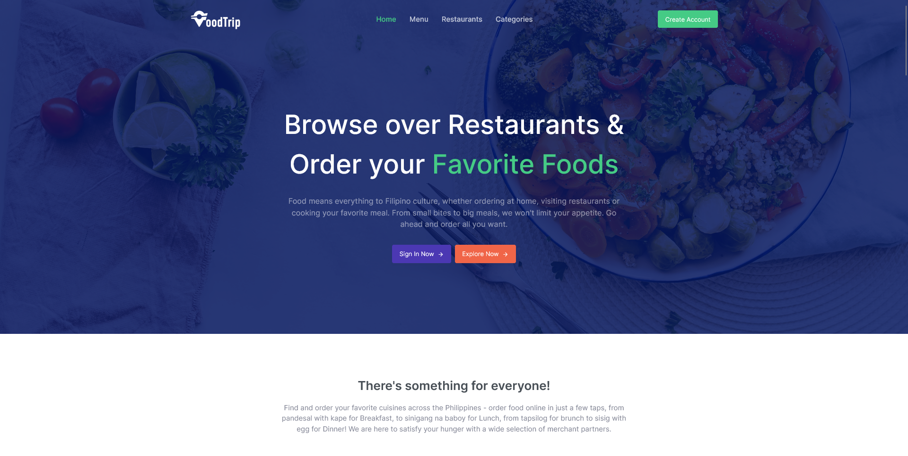
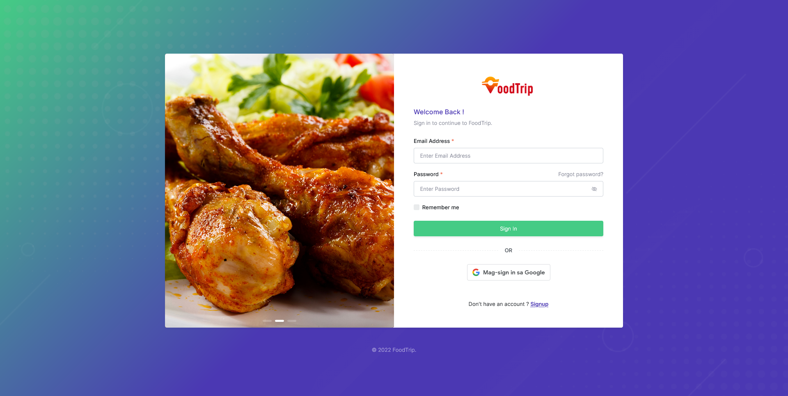
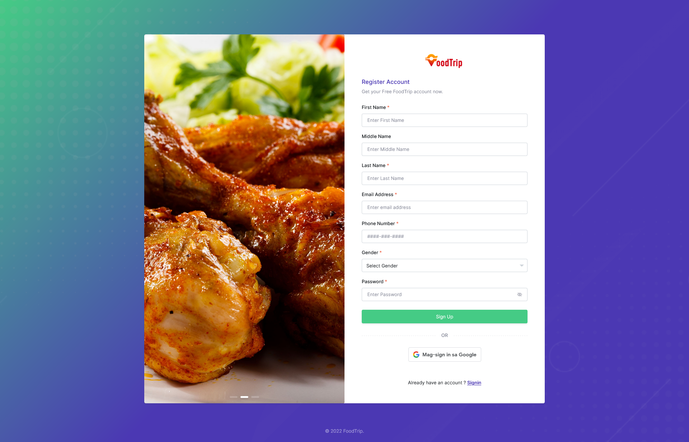

# FoodTrip 😋 Food Ordering Web App 🍕

This project is for fullfillment of requirements in subject "Application Development and Emerging Technologies". This Web Application used the [FoodTrip 😋🍕 API](https://github.com/polekstulod/foodtrip-api).

## Developers

- [Tulod, James Paul Lim](https://github.com/polekstulod) (Project Leader)
- [De Lara, Filwayne Kean Murillo](https://github.com/drollive)
- [Del Mundo, Ashlee Jude Cruz](https://github.com/AshleeJude)
- [Fallesgon, Josiah Alether Galgo](https://github.com/Josayah32)
- [Peralta, Emmanuel Escarlan](https://github.com/emmanperalta4)
- [Ulibas, Racquel Feria](https://github.com/racquelulibas)
- [Villaruz, Micah Matorre](https://github.com/micahvllz)

## Tech Stack

<a href="https://www.w3.org/html/" target="_blank" rel="noreferrer">  </a>
<a href="https://www.w3schools.com/css/" target="_blank" rel="noreferrer">  </a>
<a href="https://developer.mozilla.org/en-US/docs/Web/JavaScript" target="_blank" rel="noreferrer">  </a>
<a href="https://jquery.com/" target="_blank" rel="noreferrer">  </a>
<a href="https://getbootstrap.com" target="_blank" rel="noreferrer">  </a>
<a href="https://www.php.net" target="_blank" rel="noreferrer">  </a>
<a href="https://codeigniter.com/" target="_blank" rel="noreferrer">  </a>

## Run Locally

Clone the project in your localhost server

```bash
  git clone https://github.com/micahvllz/foodtrip-web
```

Go to the Starting Page

<code>http://localhost/foodtrip-web/</code>

## Some Screenshots

Landing Page



Login



Customer Signup



## Acknowledgements

- [Velzon - 5 in 1 Premium Multipurpose Admin & Dashboard Template](https://themesbrand.com/velzon/)

## License

[MIT](https://choosealicense.com/licenses/mit/)
